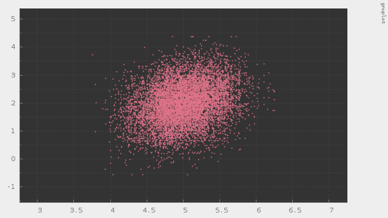

# mcmc-gs

Gibbs Sampling

---

#### これは何？

MCMCのギブスサンプリングのC++によるフルスクラッチです。

パラメタを2つの変数に分割して w=(w1, w2) とし、目的とする確率分布を p(w1, w2) とし、この確率分布から定義される条件付き確率を p(w1|w2) および p(w2|w1) とした際に、このそれぞれの条件付き確率分布からのサンプリングが容易である場合に使えるMCMCアルゴリズムです。

##### 動作サンプル

多変量正規分布に従う乱数を発生させてみた例です。

